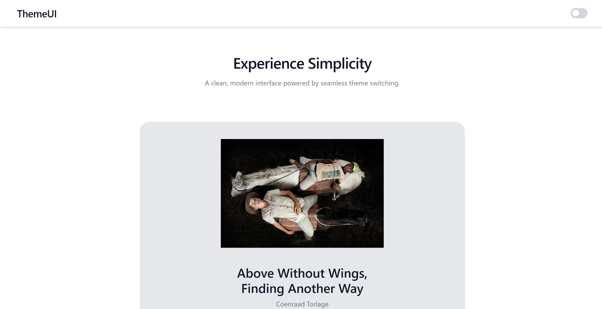
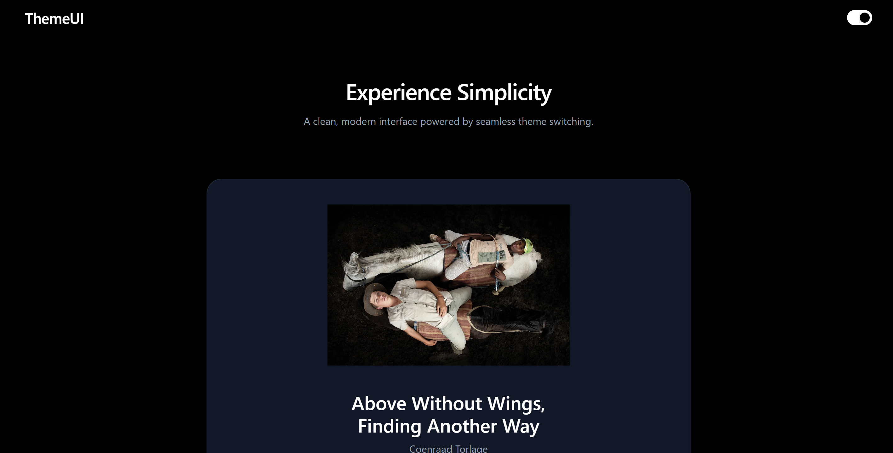

# ThemeUI – Modern Theme Switcher with React Context API

A clean and minimal UI application demonstrating seamless light/dark theme switching using React’s Context API. Built with a focus on simplicity, scalability, and modern UI practices.

## Live Demo
[Click Me](https://theme-ui-sepia.vercel.app/)

## Preview
Light Mode<br>


<br>
Dark Mode<br>


## Features
- Toggle between Light and Dark mode
- Global state management using React Context API
- Custom hook (useTheme) for clean state access
- Smooth UI transitions with Tailwind CSS
- Modular component architecture
- Fully responsive layout
- What This Project Demonstrates

This project is not just a UI toggle-it showcases important frontend engineering concepts:

- State Management without Redux
- Efficient global state using Context API
- Custom Hooks Pattern
- Separation of logic from UI
- Reusable Components
- Clean and scalable structure (Navbar, Hero, ThemeBtn)
- UI/UX Attention
- Smooth transitions and modern design principles

## Project Structure
src/<br>
│── components/<br>
│   ├── Navbar.jsx<br>
│   ├── Hero.jsx<br>
│   ├── ThemeBtn.jsx<br>
│
│── context/<br>
│   ├── theme.js<br>
│
│── App.jsx<br>
⚙️

## How It Works
T- he app uses a Theme Context to store the current theme (light or dark)
- A custom hook useTheme() provides access to:
themeMode
    - lightTheme()
    - darkTheme()
- The ThemeBtn component toggles the theme using a controlled checkbox
- Tailwind’s dark class is used to dynamically update UI styles

## Tech Stack
- React.js
- Tailwind CSS
- Context API
- JavaScript (ES6+)


## Getting Started
```
git clone https://github.com/your-username/theme-ui.git
```
```
cd theme-ui
```
```
npm install
```
```
npm run dev
```

## Future Improvements
- Persist theme using localStorage
- Add multiple themes (not just dark/light)
- Improve accessibility (ARIA roles, keyboard navigation)
- Add animation libraries (Framer Motion)

## Why This Project Matters

This project reflects real-world frontend practices:

- Clean architecture
- Maintainable state management
- Scalable component design

It’s a strong foundation for building larger UI systems.

## Author
Sagar Pani
LinkedIn: [Sagar Pani](https://www.linkedin.com/in/sagarpani/)

FullStack Developer (in progress)
Learning ReactJs + Vite, Tailwind
Building projects to learn deeply, not just to make them work.